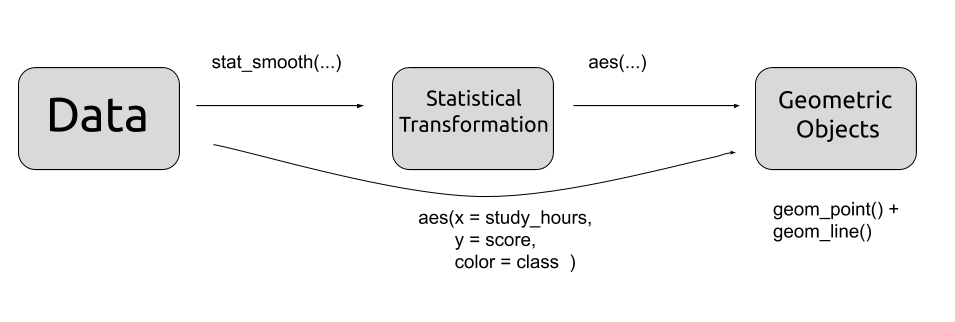

<link href="https://fonts.googleapis.com/css?family=Anton|Average|Fjalla+One|Gravitas+One|Montserrat&display=swap" rel="stylesheet"> 

```{r setup, include=FALSE}
library(ggplot2)
library(dplyr)
library(ggrepel)
library(ggthemes)
library(ggsci)
#presentation_theme  <- theme_gray() + 
#theme(axis.text = element_text(size = 18),
#      axis.title = element_text(size = 18))
     
#theme_set(presentation_theme)
knitr::opts_chunk$set(dpi=300, warning = FALSE, fig.align = 'center', message = FALSE)
options(timeout= 4000000) 

```
### `ggplot2`: What does gg stand for?

Wilkinson(2005): The Grammar of Graphics   

--

 _A statistical graphic is a __mapping__ from data to __aesthetic__ attributes (color, shape, size) of __geometric objects__ (points, lines, bars)_. 
 
--

- Set of independent components:

    - Data
 
    - Layers

        - Geometric objects (geoms)

        - Statistical Transformations (stats)

    - Scales (scale)

    - Coordinate system (coord)

    - Facets (facet)

    - Theme (theme)

---
## Let's get started
Go to:
### [saral.it/jdmx](https://saral.it/jdmx)

---
### Mappings

```{r, echo=FALSE, out.width = '100%'}


```
```{r, echo = FALSE, fig.width = 9, fig.height = 6}
set.seed(2019)
my_data  <- data.frame( class = c(rep("A",10),rep("B",10)),
                        study_hours = round(rnorm(20, mean = 24, sd = 6)))

my_data$score  <- round(my_data$study_hours * rnorm(20, mean = 2, sd = 0.3)) + round(if_else(my_data$class == "A", rnorm(20, mean = 8, sd = 2), 0))
```
* aes() is responsible for defining mappings
.pull-left[
```{r}
head(my_data)
```
]
.pull-right[

```{r, echo = FALSE, fig.width = 4, fig.height = 3}
ggplot(my_data, aes(x = study_hours, y = score, color = class)) +
#  geom_jitter(size = 3) +
  geom_point()  +
  geom_smooth(method = "lm", se = FALSE, fullrange = TRUE) +
  theme_bw() 
#  geom_smooth(method = "lm" )
```
]
---
### Data
```{r, echo = FALSE}
happiness_data  <- readRDS("./happiness_data.rds")
```
* World Happiness Report by UN Sustainable Development Solutions Network

```{r}
 head(happiness_data)
```
---
### Our first `ggplot2` graph
The relationship between `happiness` and `gdp_per_capita`.
```{r,  fig.height = 3.5, fig.width = 4.5, echo = FALSE, message = FALSE, warning = FALSE, out.width = '80%', fig.align = "center"}

ggplot(happiness_data, aes(gdp_per_capita, happiness)) +
geom_point(aes(color = continent), alpha = 0.6) +
geom_line(stat = "smooth", method = "lm", se = FALSE, color = "black") +
labs(x = "GDP per capita",
     y = "Happiness Score",
     color = "") +
  scale_y_continuous(limits = c(0,8), breaks = 0:8) +
  theme_bw() +
  theme(legend.position = "bottom") +
  theme(legend.text = element_text(
    margin = margin(r = 8, l = 0, unit = "pt"))) +
  scale_color_brewer(palette = "Set1")


 
     
```
---
### Initializing the canvas (Step 1)
* Load `ggplot2` library 
* We use `ggplot()` function (not ggplot2)
* Define the data frame
* Define the aesthetic mappings with `aes()`

```{r , out.width = '40%', fig.align = 'center'}
ggplot(happiness_data, aes( x = gdp_per_capita, y = happiness))
```
---
### Adding `geom_point` (Step 2)
* Elements are added with `+` (must be at the end of the line)
* Create scatterplots and bubble charts
* Can take `x`, `y`, `color`, `size`, `alpha` ...
* Documentation for `geom_point`:   
  https://ggplot2.tidyverse.org/reference/geom_point.html
```{r , out.width = '30%', fig.align = 'center'}
ggplot(happiness_data, aes( x = gdp_per_capita, y = happiness)) +
  geom_point()
```
* geoms inherit aesthetic mappings from the top level of the plot, which is the `ggplot()` function
---
### Adding `geom_text` 
* Elements are added with `+` (must be at the end of the line)
* Create scatterplots and bubble charts
* Can take `x`, `y`, `color`, `size`, `alpha` ...
* Documentation for `geom_point`:   
  https://ggplot2.tidyverse.org/reference/geom_text.html
```{r , out.width = '50%', fig.align = 'center'}
ggplot(happiness_data, aes( x = gdp_per_capita, y = happiness)) +
  geom_text(aes(label = country))
```
---
### Coloring vs. Mapping to a Color
* If we want to color a geom, we should add the parameter directly
```{r , out.width = '50%', fig.align = 'center'}
ggplot(happiness_data, aes( x = gdp_per_capita, y = happiness)) +
  geom_point(color = "red")
```
---
#  Coloring vs. Mapping to a Color
* If we want to map a variable to the color, we use `aes()`
```{r , out.width = '50%', fig.align = 'center'}
ggplot(happiness_data, aes(x = gdp_per_capita,
                           y = happiness,
                           color = continent)) +
  geom_point()
```
---
### Coloring vs. Mapping to a Color (Step 3)
* Note that we could put the color aesthetic in `geom_point()` as well.
```{r , out.width = '50%', fig.align = 'center'}
ggplot(happiness_data, aes(x = gdp_per_capita,
                           y = happiness)) +
    geom_point(aes(color = continent))
```
---
### Mapping to a Shape Instead

```{r , out.width = '50%', fig.align = 'center'}
ggplot(happiness_data, aes(x = gdp_per_capita,
                           y = happiness)) +
    geom_point(aes(shape = continent))
```
---
### Or both

```{r , out.width = '50%', fig.align = 'center'}
ggplot(happiness_data, aes(x = gdp_per_capita,
                           y = happiness)) +
    geom_point(aes(shape = continent, color = continent))
```
---
### We can even add a size mapping

```{r , out.width = '50%', fig.align = 'center'}
ggplot(happiness_data, aes(x = gdp_per_capita,
                           y = happiness)) +
    geom_point(aes( color = continent, size = generosity))
```
---
### Let's stick to the previous one
```{r , out.width = '50%', fig.align = 'center'}
ggplot(happiness_data, aes(x = gdp_per_capita,
                           y = happiness)) +
    geom_point(aes( color = continent))
```
---
### Setting the axis limits (Step 4 ->)
```{r , out.width = '50%', fig.align = 'center'}
ggplot(happiness_data, aes(x = gdp_per_capita,
                           y = happiness)) +
    geom_point(aes( color = continent)) +
    scale_y_continuous( limits = c(0,8)) 
```
---
### Setting the axis breaks (-> Step 4 ->)
```{r , out.width = '50%', fig.align = 'center'}
ggplot(happiness_data, aes(x = gdp_per_capita,
                           y = happiness)) +
    geom_point(aes( color = continent)) +
    scale_y_continuous( limits = c(0,8), breaks = 0:8) 
```
`seq()` function can be handy to set axis breaks.
---
### Setting axis names (-> Step 4)
```{r , out.width = '50%', fig.align = 'center'}
ggplot(happiness_data, aes(x = gdp_per_capita,
                           y = happiness)) +
    geom_point(aes( color = continent)) +
    scale_y_continuous(name = "Happiness index", limits = c(0,8), breaks = 0:8) +
      scale_x_continuous(name = "Log GDP per Capita")
```
`seq()` function can be handy to set axis breaks.
---

### Scales

* Control how data map to visual properties
* `ggplot2` has well selected defaults, but often customization is needed
* There are several "ready to use" scales for different type of aesthethics

[`scale_x_discrete()`](https://ggplot2.tidyverse.org/reference/scale_discrete.html)  
[`scale_x_continuous()`](https://ggplot2.tidyverse.org/reference/scale_continuous.html)  
[`scale_shape()`](https://ggplot2.tidyverse.org/reference/scale_shape.html)  
[`scale_color_brewer()`](https://ggplot2.tidyverse.org/reference/scale_brewer.html)  More information [Brewer Scale Palettes](http://colorbrewer2.org/#type=qualitative&scheme=Set1&n=3)  

* And can be built manually:

[DIY scales](https://ggplot2.tidyverse.org/reference/scale_manual.html)
```
scale_colour_manual() 
scale_fill_manual() 
scale_size_manual() 
scale_shape_manual() 
scale_linetype_manual() 
scale_alpha_manual()
scale_discrete_manual() 
```

---
### Setting color scale : Brewer palette (Step 5)
```{r , out.width = '50%', fig.align = 'center'}
ggplot(happiness_data, aes(x = gdp_per_capita,
                           y = happiness)) +
  geom_point(aes( color = continent)) +
  scale_y_continuous(name = "Happiness index", limits = c(0,8), breaks = 0:8) +
    scale_x_continuous(name = "Log GDP per Capita") +
    scale_color_brewer(name = "Continent", palette = "Set1")
```
---
### Setting color scale : Custom
```{r , out.width = '50%', fig.align = 'center'}
ggplot(happiness_data, aes(x = gdp_per_capita,
                           y = happiness)) +
  geom_point(aes( color = continent)) +
  scale_y_continuous(name = "Happiness index", limits = c(0,8), breaks = 0:8) +
    scale_x_continuous(name = "Log GDP per Capita") +
    scale_color_manual(name = "Continent",
                       values = c("blue", "orange", "red", "purple", "cyan"))
```
---
### Setting color scale : Custom
```{r , out.width = '45%', fig.align = 'center'}
ggplot(happiness_data, aes(x = gdp_per_capita,
                           y = happiness)) +
  geom_point(aes( color = continent)) +
  scale_y_continuous(name = "Happiness index", limits = c(0,8), breaks = 0:8) +
    scale_x_continuous(name = "Log GDP per Capita") +
    scale_color_manual(name = "Continent",
                       values = c("blue", "orange", "red", "purple", "cyan"),
                       labels = c("AFR","AMR","ASI","EUR","OCE"))
```
---
### Adding `geom_smooth()`(Step 6)
```{r , out.width = '60%', fig.align = 'center', fig.height = 5}
ggplot(happiness_data, aes(x = gdp_per_capita,
                           y = happiness)) +
  geom_point(aes( color = continent)) +
  geom_smooth() +
  scale_y_continuous(name = "Happiness index", limits = c(0,8), breaks = 0:8) +
  scale_x_continuous(name = "Log GDP per Capita") +
  scale_color_brewer(palette = "Set1")
```
---
### Adding linear `geom_smooth()` (Step 7)
```{r , out.width = '60%', fig.align = 'center', fig.height = 5}
ggplot(happiness_data, aes(x = gdp_per_capita,
                           y = happiness)) +
  geom_point(aes( color = continent)) +
  geom_smooth(method = "lm") +
  scale_y_continuous(name = "Happiness index", limits = c(0,8), breaks = 0:8) +
  scale_x_continuous(name = "Log GDP per Capita") +
  scale_color_brewer(palette = "Set1")
```
---
### Final Touches (Step 7)
```{r , out.width = '60%', fig.align = 'center', fig.height = 5}
ggplot(happiness_data, aes(x = gdp_per_capita,
                           y = happiness)) +
  geom_point(aes(color = continent), alpha = 0.5) +
  geom_smooth(method = "lm", se= FALSE, color = "black") +
  scale_y_continuous(name = "Happiness index", limits = c(0,8), breaks = 0:8) +
  scale_x_continuous(name = "Log GDP per Capita") +
  scale_color_brewer(name = "", palette = "Set1") +
  theme_bw()
```
---
### Facetting (Bonus Step)
```{r , out.width = '90%', fig.align = 'center', fig.height = 4, fig.width = 9 }

ggplot(happiness_data, aes(x = gdp_per_capita,
                           y = happiness)) +
  geom_point(aes(color = continent), alpha = 0.5) +
  geom_smooth(method = "lm", se= FALSE, color = "black") +
  scale_y_continuous(name = "Happiness index", limits = c(0,8), breaks = 0:8) +
  scale_x_continuous(name = "Log GDP per Capita") +
  scale_color_brewer(palette = "Set1") +
  facet_grid( ~ continent) +
  theme_bw()

```
---
### Before we go on:
```{r echo=FALSE, out.width = '60%'}

```
---

```{r echo=FALSE, out.width = '80%'}

```
---
```{r echo=FALSE, out.width = '80%'}

```

--

```{r echo=FALSE, out.width = '80%'}

```

---
### Bar charts in ggplot
* `geom_col()`: General mapping
    * x: categorical variable
    * y: bar height
    
* `geom_bar()`: Used for counting instances in data
    * x: categorical variable
---
### Bar charts in ggplot : geom_col()
```{r}
library(dplyr)
happiness_data_subset  <- happiness_data  %>% filter( country %in% c("Italy", "Germany", "Turkey") )
head(happiness_data_subset)
```
---
### Bar charts in ggplot : geom_col()
```{r, out.width = '50%'}
ggplot(happiness_data_subset, aes(x = country, y = happiness)) +
  geom_col()
```
---
### Bar charts in ggplot : geom_col()
```{r, out.width = '50%', fig.width = 6, fig.height = 3}
library(dplyr)
ggplot(happiness_data_subset, aes(x = country, y = happiness)) +
  geom_point(size = 4) +
  scale_y_continuous(limits = c(0,8)) +
  coord_flip()
  

```
---
### Nobel Prize Data
* ex2.R

```{r, echo = FALSE}
nobel_winners <- readr::read_csv("./nobel_winners.csv")

# Extracting the year from birthdate
nobel_winners  <- nobel_winners  %>%
  mutate(birth_year = format(nobel_winners$birth_date, '%Y'))  %>%
# Calculating the age
  mutate(age_awarded = prize_year - as.numeric(birth_year))

```

```{r}

glimpse(nobel_winners)
```
---
### Bar Charts: geom_bar()
* Let's create our first plot
* Note that geom_bar automatically counts the number of instances (default behavior)

```{r, out.width = '50%'}
ggplot(nobel_winners, aes(x = category))+
  geom_bar()

```
---
### Bar Charts: geom_bar()
* Two types of bar charts in ggplot: `geom_bar()` and `geom_col`.
* `geom_col()` is a simple 
* Let's create our first plot
* Note that geom_bar automatically counts the number of instances (default behavior)

```{r, out.width = '50%'}
ggplot(nobel_winners, aes(x = category, fill = gender))+
  geom_bar()

```
---
### Investigating the data
What are the NA's?

```{r}
nobel_winners  %>% filter(is.na(gender))  %>% select(full_name)

```{r}
library(dplyr)
unique(nobel_winners$laureate_type)
```
---
### Let's take individual laureates only 
```{r}
nobel_winners_ind  <- nobel_winners  %>% filter(laureate_type == "Individual")
```
---
### Let's take individual laureates only 
```{r, out.width = '50%'}
ggplot(nobel_winners_ind, aes(x = category, fill = gender))+
  geom_bar()
```
---
### Different possibilities
```{r, out.width = '50%'}
ggplot(nobel_winners_ind, aes(x = category, fill = gender))+
  geom_bar(position = "dodge")
```
---
### Different possibilities
```{r, out.width = '50%'}
ggplot(nobel_winners_ind, aes(x = category, fill = gender))+
  geom_bar(position = "fill")
```
---
### A continous and a categorical variable: geom_boxplot()
```{r, out.width = '50%'}
ggplot(nobel_winners, aes(y = age_awarded, x = category)) +
  geom_point()
```
---
### Layering up: geom_jitter() and geom_boxplot()
```{r, out.width = '50%'}
ggplot(nobel_winners, aes(y = age_awarded, x = category)) +
  geom_jitter() +
  geom_boxplot(fill = NA, color = "blue", outlier.shape = NA)
```
---
```{r, out.width = '50%'}
ggplot(nobel_winners, aes(x = age_awarded)) +
  geom_histogram() +
  facet_grid(category ~ .)

```
---

```{r, out.width = '50%'}
ggplot(nobel_winners, aes(x = age_awarded)) +
  geom_density(fill = "blue") +
  facet_grid(category ~ .)

```
---


```{r, out.width = '50%'}
nobel_winners  %>%
  filter(!is.na(age_awarded))  %>%
  group_by(prize_year)  %>%
  summarise( mean_age = mean(age_awarded))  %>% 
ggplot(aes(x = prize_year, y = mean_age )) +
geom_point() +
geom_line() +
scale_x_continuous(breaks = seq(1800,2019,10)) +
scale_y_continuous(limits = c(15,99))
```
---
```{r, out.width = '50%'}
nobel_winners  %>%
  filter(!is.na(age_awarded))  %>%
  group_by(prize_year)  %>%
  summarise( mean_age = mean(age_awarded))  %>% 
ggplot(aes(x = prize_year, y = mean_age )) +
geom_point() +
geom_line() +
geom_smooth() +
scale_x_continuous(breaks = seq(1800,2019,10)) +
scale_y_continuous(limits = c(15,99))
```
---

```{r, out.width = '50%'}
nobel_winners  %>%
  filter(!is.na(age_awarded))  %>%
  group_by(prize_year, category)  %>%
  summarise( mean_age = mean(age_awarded))  %>% 
ggplot(aes(x = prize_year, y = mean_age )) +
geom_point() +
geom_line() +
geom_smooth(method = "lm", se = FALSE) +
scale_x_continuous(breaks = seq(1800,2019,10)) +
scale_y_continuous(limits = c(15,99)) +
facet_grid(category ~ .)
```
---
### Jittered geom_point: geom_jitter()
* Summarizes the date into five values
```{r, out.width = '50%'}
ggplot(nobel_winners, aes(y = age_awarded, x = category)) +
  geom_jitter()
```
---
# Here we go
---
```{r, echo = FALSE, message = FALSE, warning = FALSE, fig.width = 12, fig.height = 9, out.width = '100%'}


# Extracting the year from birthdate
nobel_winners  <- nobel_winners  %>%
  mutate(birth_year = format(nobel_winners$birth_date, '%Y'))  %>%
# Calculating the age
  mutate(age_awarded = prize_year - as.numeric(birth_year))


nobel_winners_summary  <- nobel_winners %>%
  group_by(category)  %>%
  summarise( mean_age_awarded = mean(age_awarded, na.rm = TRUE), sd_age_awarded = sd(age_awarded, na.rm = TRUE) )  %>%
  arrange(mean_age_awarded) 


#nobel_winners  %>% summarise( mean = mean(age_awarded, na.rm = TRUE), min = min(age_awarded, na.rm = TRUE), max = max(age_awarded, na.rm = TRUE))  


nobel_winners  <- nobel_winners  %>% mutate( category = factor(category, levels = nobel_winners_summary$category))
nobel_winners_summary  <- nobel_winners_summary  %>% mutate( category = factor(category, levels = nobel_winners_summary$category))

ggplot(nobel_winners, aes(x = category, y = age_awarded, color = category))+
      geom_hline( yintercept = mean(nobel_winners$age_awarded, na.rm = TRUE), color = "gray20", linetype = "dashed") +
geom_jitter(alpha = 0.3, width = 0.1, height = 0, size = 2) +
  geom_point(data = nobel_winners_summary, aes(y = mean_age_awarded, fill = category), color = "black", size = 10, pch=21, alpha = 0.9) +
    geom_text_repel(data = filter(nobel_winners, age_awarded == min(nobel_winners$age_awarded, na.rm = TRUE) | age_awarded == max(nobel_winners$age_awarded, na.rm = TRUE)), aes(label = full_name),
                  color = "black",
                  xlim = c(4.5,5.5),
                  arrow = arrow(length = unit(0.03, "npc"))) +
#  geom_line(ylim = 40) +
    labs(title = "Nobel Prize winners by age and discipline",
         subtitle = "The age of prize winners at the time they won the prize",
         y = "Age awarded", x = "") +
  theme_economist() +
  theme(panel.grid.major.y = element_blank(),
        panel.grid.major.x = element_line ( size = .5)) +  
  guides(fill = FALSE, color = FALSE) +
  scale_y_continuous( limits = c(15,90), breaks = seq(10,90,10)) +
  annotate("text", x = 7.2, y = 28, label = "Average of all disciplines") +
  geom_curve(x = 7, y = 30, xend = 6.7, yend = 58, curvature = 0.2, size = 0.3, color = "black", arrow = arrow(length = unit(0.03, "npc"))) +
  annotate("text", x = 7.5, y = 28, label="") + # this is a trick
  coord_flip() 
  ```
---
```{r}
library(rworldmap)
library(ggplot2)
map_world <- map_data(map="world")

#Add the data you want to map countries by to map.world
#In this example, I add lengths of country names plus some offset

map_world_happiness  <- map_world  %>% rename(country = region)  %>% left_join(happiness_data, by = "country") 

map_world_new  <- map_world  %>% rename(country = region) 

ggplot() +
  geom_map(data=map_world_happiness, map=map_world, aes(map_id=country, x=long, y=lat, fill=happiness)) +
  coord_equal()

```
---
```{r}
library(rworldmap)
library(ggplot2)
map_world <- map_data(map="world")

#Add the data you want to map countries by to map.world
#In this example, I add lengths of country names plus some offset

map_world_happiness  <- map_world  %>% rename(country = region)  %>% left_join(happiness_data, by = "country") 

map_world_new  <- map_world  %>% rename(country = region) 

ggplot() +
  geom_map(data=map_world_happiness, map=map_world, aes(map_id=country, x=long, y=lat, fill=happiness), color = "black", size =0.2) +
  scale_fill_distiller(direction = 1) +
  coord_equal()

```
